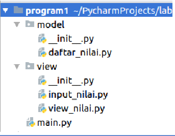

# UAS

<b>Nama : Baihaqi Asa'ari Lubis</b>

<b>NIM : 312210720</b>

<b>Prodi : Teknik Informatika</b>

<b>Mata Kuliah : Bahasa Pemrograman</b>

Pada Pertemuan ini saya akan membuat program dengan Package dan modul dengan stuktur

* daftar_nilai.py berisi modul untuk:
    tambah_data, ubah_data, hapus_data, dan cari_data
* view_nilai.py berisi modul untuk:
    cetak_daftar_nilai, cetak_hasil_pencarian
* input_nilai.py berisi modul untuk:
    input_data yang meminta pengguna memasukkan data.
* main.py berisi program utama (menu pilihan yang memanggil semua menu yang ada)

### Dokumentasi
Untuk dokumentasi dapat di download melalui [Dokumentasi]()

### Demo Program
Untuk demo program bisa dilihat dengan cara mengunjungi [Demo Program]()
